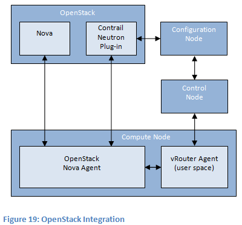

OpenContrail体系架构文档（中文版）

英文原文：http://OpenContrail.org/OpenContrail-architecture-documentation/

翻译者：@KkBLuE知行合一  其微信号：kkbluepublic， SDNAP.com翻译整理，
https://www.sdnlab.com/sdn-guide/14892.html

Roy Yang 校译

OpenContrail 体系架构文档
===

# 1  OpenContrail 概要介绍

本章节介绍OpenContrail系统 —— 一个SDN的扩展平台。

所有主要内容在本章中都有简略介绍，详细内容会在后续章节中继续描述。

## 1.1  使用案例

OpenContrail是一个扩展系统，可以应用在不同的网络环境中，但是，其使用的主要驱动力在于如下两个体系结构下:

* 云计算网络 - 企业和运营商的私有云，基础架构即服务 (IaaS)和云服务提供商提供的虚拟私有云（VPCs）服务。
* 在运营商网络中的网络功能虚拟化（NFV）- 为运营商边界网络提供增值服务，如提供业务边界网络，宽带用户管理边界网络和移动边界网络.

私有云，虚拟私有云（VPC）和基础架构即服务（IaaS）的使用场景里，都需要多租户虚拟数据中心。在这些案例中，都在一个数据中心中存在多个租户，共享物理资源（物理服务器，物理存储，物理网络）。每个租户被指定使用他们自己的逻辑资源（虚拟机，虚拟存储，虚拟网络），这些租户的逻辑资源之间相互隔离，除非基于某些安全策略使之可以相互访问。数据中心中的虚拟网络一样可以通过物理的IP VPN或者L2 VPN进行互联。

网络功能虚拟化（NFV）的使用场景中引入了（编排）协调器和网络管理功能，例如防火墙，入侵检测/预防系统（IDS/IPS)，深度包检测（DPI），数据缓存，广域网优化等等，这些功能在虚拟机中实现，从而替代了以往的传统物理设备。产品快速推向市场以及成本优化都是网络服务虚拟化的推动力。

## 1.2 OpenContrail 控制器和虚拟路由器(vRouter)

OpenContrail系统由两个主要部件组成：OpenContrail控制器和OpenContrail虚拟路由器（vRouter）

OpenContrail控制器是一个逻辑上集中，但是物理上分布的 SDN (软件定义网络)控制器，为虚拟网络提供管理，控制和分析功能。

OpenContrail vRouter（虚拟路由器）是一个转发平面（或者是分布部署的路由器），运行在虚拟服务器的hypervisor，将网络从一个数据中心的网络的物理路由器和交换机扩展成一个虚拟的基于虚拟服务器主机之间通讯的overlay网络（关于overlay网络的详细介绍将会在1.4章节中, OpenContrail虚拟路由器从概念上和现在的商用和开源vSwitch（如OVS）很像，但是他会提供路由以及更高层的服务（使用vRouter替代vSwitch）。

OpenContrail控制器提供了系统的逻辑集中控制平面和管理平面，并且协调管理vRouter。

## 1.3 虚拟网络 (Virtual networks)

虚拟网络是OpenContrail系统的重要部件，虚拟网络是部署物理网络顶层的逻辑架构，虚拟网络也用于替代基于VLAN隔绝网络的方案，为多租户提供虚拟数据中心，每一个租户或者应用可以拥有一个或者多个虚拟网络，每个虚拟网络之间相互隔绝，除非使用安全策略允许之间相互访问。

虚拟网络通过在数据中心的边界路由器上使用MPLS （多协议标签交换） L3 VPN或者 EVPN （以太网 VPN），作为物理网络连接扩展使用（译者注，实际上是使用这些技术实现跨数据中心的虚拟化）

虚拟网络同样可以使用部署在NFV环境和服务链（service chain）上，详细内容会在2.3中介绍

## 1.4  Overlay Networking

虚拟网络可以使用各种机制来实现。 例如，每个虚拟网络可以实现为虚拟局域网（VLAN），虚拟专用网络（VPN）等。

虚拟网络也可以使用在两个网络中 - 物理 underlay 网络或者虚拟 overlay网络。Overlay网络技术已经广泛应用在无线局域网产业十年以上，但是现在数据中心网络为之赋予了新意，并且被不同的组织标准化，例如IETF下属的NVO3工作组，并且通过不同厂商的开源或者商业网络虚拟化产品进行部署。

物理底层网络的作用是提供“IP fabric 结构” - 其职责是提供从任何物理设备（服务器，存储设备，路由器或交换机）到任何其他物理设备的单播IP连接。 理想的底层网络从网络中的任何点到网络中的任何其他点提供统一的低延迟，无阻塞，高带宽连接。

在虚拟服务器的虚拟化管理程序中运行的vRouters使用动态“隧道”网格在物理底层网络之上创建虚拟覆盖网络。 对于OpenContrail，这些覆盖隧道可以是通过 GRE/UDP隧道或VXLAN隧道的MPLS。

底层物理路由器和交换机不需要保存任何租户的信息：他们不需要保存任何MAC地址，IP地址或者虚拟机之间的策略，在底层物理交换机和路由器的转发表中，只会包含物理server的IP前缀或者MAC地址。连接虚拟网到物理网的网关路由器或者交换机是一个特例，因为他们需要保证虚拟网络和物理网络的通讯，他们需要包含租户的MAC或者IP地址信息。

从另一个方面说，虚拟路由器会包含每一个租户的信息，他们会包含每一个虚拟网络的独立转发表（或者称为一个路由实例），这些转发表包含虚拟机的IP前缀（在L3 overlay网络中）或者MAC地址（在L2 overlay网络中）。并非每一个虚拟路由器需要保存整个数据中心所有虚拟机的所有IP前缀或者所有MAC地址信息。给定的虚拟路由器只需要保存本地服务器存在的路由实例的信息上（举例说明，至少每个服务器上存在一个虚拟机）（译者注：实际上就是每个虚拟路由器会负责一个每一个物理server上的虚拟机内部，或者之间的通讯，会保存路由表，转发表等）。

## 1.5  基于MPLS L3 VPNs 和 EVPNs 的overlay架构

厂商和标准化组织已经提出了真对于overlay网络的各自不同的控制平面和数据平面协议。

例如，IETF  VXLAN 草案[（draft-mahalingam-dutt-dcops-vxlan）](https://datatracker.ietf.org/doc/draft-mahalingam-dutt-dcops-vxlan/)
提出了一种新的数据平面封装，并提出了一种类似于标准以太网 “洪泛和学习源地址” 行为的控制平面，用于填充转发表，并要求底层网络中的一个或多个组播组来实现泛洪（flooding）。

受此类技术的影响，OpenContrail 的解决方案在概念上类似于标准的MPLS L3VPNs (用于 L3 overlays)和 MPLS EVPNs (用于 L2 overlays)。

在数据平面，OpenContrail 支持MPLS over GRE，这种数据平面的封装可以被目前的大部分主流厂商的现有路由器支持；OpenContrail 也同时支持其他数据平面封装标准，例如MPLS over UDP (在多路径和CPU优化上更具优势) 和 VXLAN。其他的封装标准，例如NVGRE会非常容易在后续版本中添加。

OpenContrail 系统的控制平面或者物理网关路由器（或者交换机）之间的控制平面协议是BGP（以及使用 Netconf 用于管理），这也同MPLS L3VPN 和 MPLS EVPN使用的控制平面协议相同。

用于 OpenContrail 控制器和 OpenContrail 虚拟路由器之间的协议基于[XMPP](http://datatracker.ietf.org/wg/xmpp/)，XMPP信息的交互方式在IETF[草案](https://datatracker.ietf.org/doc/draft-ietf-l3vpn-end-system/) 上已有描述，尽管语法不同，但是语意上和BGP非常相似。

实际上，OpenContrail 系统使用的控制和转发平面协议与MPLS L3VPN和 EVPN协议非常类似，这样做存在诸多好处：这些协议比较成熟，而且易于扩展，被广泛应用在生产网络，并被多个厂商产品支持，可以无缝互操作，而无需软件网关（译者注：最后一句话实际上是重点，使用老技术来保证新部署模式不需要更新硬件设备）

## 1.6 OpenContrail 和开源

OpenContrail 被设计可以运行在一个开源的云网络环境中，用于提供完整的集成端到端的解决方案

* OpenContrail 系统可以和开源的hypervisor集成，例如KVM和XEN；
* OpenContrail 系统可以和开源的虚拟化协调协同集成，例如 OpenStack 和 CloudStack；
* OpenContrail 系统可以和开源的服务器管理系统集成，例如chef, puppet, cobbler和 ganglia。

OpenContrail 目前遵从Apache 2.0许可，这意味着任何人可以开发和修改OpenContrail系统代码，不需要承担公布或者释放修改代码的任何义务

Juniper网络同时提供OpenContrail系统的商用版本，为Juniper网络和其代理商提供整个开源栈（不仅是OpenContrail系统，还包括其他开源组件如OpenStack）的商业支持。

OpenContrail系统的开源版本不是一个“戏弄者”（译者注：不是随便玩玩的版本），会提供和商用版本一样的功能，以及扩展性。

## 1.7  可扩展架构和高可用性 Scale-Out Architecture and High Availability

前文我们提到，OpenContrail控制器是一个逻辑集中化的平台。

物理分布意味着 OpenContrail控制器结合不同类型的节点，每一个都可以有多个实例，提供高可用性和层次化扩展，这些节点实例可以是物理服务器或者虚拟机，最小部署环境下，这些节点可以合并在一个server上，整个系统一共三个类型的节点：

* ``配置节点``主要负责管理层。``配置节点``提供北向REST应用程序接口（API），可以用于配置系统，或者获取系统的运行状态信息。使用层次化数据库组件表现实例服务，实例化的服务是以一个可横向扩展的数据库为对象，而这个数据库通过一个正式的服务数据模型所描述（更多的数据模型在后面描述）。配置节点同时也包含一个转换引擎（有时可以理解为``编译器``），将高层级服务数据模型的组件转换成相应的更多的低层级技术数据层面的组件。也就是说，高层级服务数据模型描述什么服务需要被部署，而低层级技术数据模型描述什么服务通过什么技术怎样被部署，配置节点使用IF-MAP (Interface for Metadata Access Points)发布低层级技术数据平面的内容给控制平面。

* ``控制节点``部署在控制平面的逻辑集中部分。不是所有的控制平面功能全部逻辑集中 —— 一些控制平面的的功能依然会在网络中的物理和虚拟路由器上以分布式的方式部署（译者注：也就是说控制平面的功能也会向以前的组网一样，在每一个路由器或者交换机上），``控制节点``使用IF-MAP协议监控底层技术数据模型的内容，并通过配置节点进行计算描述网络的需要状态。``控制节点``使用南向协议的组合（combination ) 来达到“使其成真”的目的，例如把网络的实际状态等同于网络实际需要的状态（译者注：就是按需定义网络）。当前的初代版本，OpenContrail系统的南向协议包括XMPP （Extensible Messaging and Presence Protocol）去控制 OpenContrail虚拟路由器，一如 BGP和Netconf协议的组合去控制物理路由器。控制节点同时使用BGP去进行其他节点控制节点多个实例的状态同步，来达到扩展和高可用性的目的。

* ``分析节点``的职责是收集，核对和展示分析信息，用于排除网络故障和了解网络的使用情况。每个 OpenContrail 系统的组件会产生系统中每一个显著事件的详细记录，这些时间记录会发送给分析节点一个或者多个实例（扩展目的），在一个层次化可扩展的数据库中核对和储存信息，提供更便于时间系列分析和查询的优化数据格式。``分析节点``具有事件发生时自动触发和收集详细信息的机制，目标是可以获取任何问题的故障原因，而无需重现故障。分析节点提供分析查询北向接口 REST API。

OpenContrail控制器的物理分布式特性是一个特殊的功能，因为这可以使任何节点的多个冗余实例，运行在[主-主]模式（相对于另一种模式是[主-备]模式），系统可以在任一节点故障时持续工作而不会有任何中断。当某一节点变得超载，节点的其他实例将会被实例化，负载可以自动重新分布，这样可以防止单一节点成为瓶颈，使得系统可以具备极大的扩展性---支持数以万计的服务器。

逻辑集中意味着 OpenContrail 系统的行为是一个单一的逻辑点，尽管实际上他会部署成为集群或者多个节点。

## 1.8 数据模型核心角色：SDN即编译器（compiler）

数据模型扮演着OpenContrail系统中的中心角色，一个数据模型包括一整套的对象组件（objects），及其功能（capability），相互之间的关系。

数据模型允许应用程序以声明式而非命令式的方式表达其意图，这对于实现程序生产力至关重要。 OpenContrail架构的一个基本方面是由平台和应用程序操纵的数据由平台维护。 因此应用程序可以被视为几乎是无状态的。 这种设计最重要的结果是，单个应用程序不必担心高可用性，规模和对等的复杂性。
> 译者注：个人理解是OpenContrail希望达到的目的是业务的快速部署，以前部署业务，除了服务器上面配置之外，还需要在网络层进行进一步的配置，而OpenContrail里面的数据模型可以让应用快速通告，而不担心基础架构网络的调整）

有两类数据模型：高层级服务(service)数据模型和低层级技术(technology)数据模型。这两种数据模型都是使用当前基于IF-MAP XML模式的正式数据建模语言来描述的，尽管YANG也被认为是未来可能的建模语言。

高层级服务数据模型在抽象化的最高层描述网络所需要的状态，使用组件直接将服务对应到终端用户上，例如，虚拟网络，连接策略或者安全策略等

低层级技术数据模型描述在抽象层中非常底层的网络所需要的状态，使用组件来对应特定的网络协议，例如，BGP的路由标记（RT）或者VXLAN的网络标识。

配置节点的职责就是将高层级服务数据模型的变化转换成低层级技术数据模型的变化。这在概念上和即时编译（JIT）类似，因此 “SDN即编译器” 在有时用于描述 OpenContrail系统的体系结构。

控制节点的职责是识别网络需要的状态，这种状态被诸如 XMPP，BGP和Netconf这些南向协议的组合形成的低层级技术数据模型所描述。

> 译者注：这段比较晦涩难懂，但是整体看来并不复杂，重点在于，我们要从数据中心应用的角度去理解，简单来说，数据中心内部服务器上需要跑各种类型的服务，这些服务之间的通讯靠数据中心内部的交换机以及路由器实现，在以前的部署环境中，当我们开启一个业务，或者说在数据中心中建立一个业务分区，那么我们需要做的是，在物理机或者VM上安装服务，然后，根据服务的要求，建立和其他分区的流量转发策略以及安全策略，这需要在不同的设备上去进行配置来实现一个业务的开局，那么在“SDN”的环境中，我们现在把数据中心想象成一个整体来考虑，其中，交换机等基础架构的工作是只需要提供一个物理接口，接下来要做的就是有一个集成化的工具，也就是OpenContrail系统，从创建虚拟机开始，一路next，直接把服务开启，网络也瞬间进行调整，这样实现“SDN”的目的，在这个思路下，上面的高层级和低层级，控制和配置模型的介绍，实际上就是事先这个思想的技术而已。

## 1.9  北向API接口

OpenContrail控制器中的``配置节点``为开通（provisioning）或编排（orchestration）系统提供北向 REST API接口。北向 REST PAI会由格式化的高层级数据模型自动创建。这保证北向REST API是“一等公民”，意味着任何服务可以通过REST API进行开通。

REST API采用安全通讯方式：使用HTTPS用于验证和加密，并且提供基于策略的授权。同时，API可以由多个配置节点实例加载，具有水平扩展。

## 1.10 图形化用户接口

OpenContrail系统也提供图形化接口，GUI 完全使用之前描述的REST API 构建，保证不会在API内有差异。同时，我们期望大规模部署或者运营商OSS/BSS系统可以使用REST API来集成。

## 1.11   可扩展平台

OpenContrail系统的初始版本使用特定的高层级服务数据模型，特定的低层级技术数据模型，以及转换引擎进行前者后者的映射。此外，OpenContrail系统的初代版本也是用特定的南向协议集合。

高级服务数据模型在OpenContrail系统的初始版本中的模型化服务结构包括：租户，虚拟网络，连接策略和安全策略。选择这些模型组件支持的基本业务环境主要是云计算网络和NFV（译注：适用环境：云计算网络，多租户网络）；

低层级服务数据模型在OpenContrail系统的初始版本中主要面向的服务部署模型是使用overlay networking（网络构建模型：overlay）；

配置节点的转换引擎包括“编译器”去实现高层级服务数据模型到低层级数据模型的转换映射；

初始版本控制节点使用的南向协议包括XMPP，BGP，Netconf；

OpenContrail系统是一个扩展平台，意味着，在未来的版本中，我们可以通过组件扩展的方式去支持更多的用户部署环境和网络技术

* 高级服务数据模型可以扩展新的组件去支持新的服务。例如：运营商核心网络的流量工程（traffic engineering）和带宽日历（bandwidth calendar）（根据日期进行流量管理）
* 低层级服务数据模型也可以基于其中一个原因进行扩展。相同的高级服务使用不同的技术去进行部署，例如，多租户可以使用VLAN去替代overlay，新的高层级服务的引入会需要新的低层级技术，例如引入流量工程或者带宽日历作为高级服务就需要引入新的低层级组件，例如TE-LSP。

> 译者注：这章定义了OpenContrail系统的使用环境：用于云计算或者多租户的数据中心，采用overlay的网络模型，当然，作为一个可以扩展的系统，在未来版本中，可以根据业务的需要增加新的服务，但是有了新的服务，也就需要新的技术。

* 转换引擎可以为映射现在的高级服务组件到新的低层级技术组件（实现当前业务的新的方式或者新的网络技术），或者映射新的服务组建到新的或者现有的低层级技术组件（例如部署新服务）进行扩展。

新的南向协议可以引入到控制节点中，这主要用于支持网络中使用不同协议的新类型的物理或者虚拟设备。例如特定厂商的网络设备使用的CLI命令行接口可以被引入，或者可能因为需要部署新的协议，新的组件需要引入到低层级技术数据层面中。

# 2  OpenContrail系统结构细节

如图1所示，OpenContrail系统包含两个部分：一个逻辑集中但是物理分布的控制器和一个vRouter(虚拟路由器)的集合，使用软件转发模式部署在通用虚拟服务器的hypervisor层。

控制器提供北向REST API接口供应用使用，这些API用于和云协调系统集成，如通过 Neutron（以前叫做quantum）和 OpenStack集成，REST API也可以被其他应用以及或运营商的OSS/BSS系统使用，最终，REST API被部署在OpenContrail系统内基于网页的GUI集成

OpenContrail系统提供三个接口：a)北向接口集合用于与编排系统和应用通讯；b)南向接口用于与虚拟网络环境（虚拟路由器）或者物理网络环境(网关路由器和交换机)通讯；c)东西向接口用于和其他控制器对等通讯。OpenStack和CloudStack是支持的编排系统（Orchestration）；标准BGP用于东西向接口；XMPP用于虚拟路由器（vRouter）的南向接口，BGP、Netconf和南向接口用于物理网关路由器和交换机。

在内部，控制器包括三个主要组件：

* 配置节点的职责是通过网络环境的协作，为高层级数据模型到低层级数据模型提供转换。（译者注：把上层的应用使用底层技术进行实现）
* 控制节点的职责是在网络环境和对等系统之间进行低层级状态信息的转播，保证整个环境的信息一致。（译者注：进行信息同步，例如BGP信息，路由信息等）
* 分析节点的职责是记录网络环境的实时状态，抽象化数据，并且适宜表现出来供应用进行使用（分析数据，呈现数据）

所有的节点都会在本章的后面详细描述。


``虚拟路由器``（vRouter）可以理解为完全以软件方式部署的网元（network element）。他们负责通过服务器到服务器之间的通道进行一个虚拟机到另一个虚拟机之间的数据包转发。这些overlay网络的通道位于物理IP-over-Ethernet网络的上层。每个虚拟路由器包含两个部分：一个用户空间代理部署控制平面，一个内核模块部署转发引擎。

OpenContrail 系统部署三个基本组成部分：

1. 多租户，也被理解为网络虚拟化或者网络分片，用于创建虚拟网络，提供封闭用户组 (Closed User Groups,CUG)来设置虚拟机；

2. 网关功能：通过``网关路由器``连接虚拟网络到物理网络（如，互联网），连接非虚拟化的服务器，或者通过``网关``连接虚拟网络的网络服务；

3. 服务链：也被理解为网络功能虚拟化（NFV），通过物理或者虚拟网络服务（例如防火墙，深度包检测，负载均衡）形成一个有序的流量服务流。

### 2.1.1 节点

我们转到系统的内部服务架构上，如图2所示，系统通过通用x86服务器运行的相互协作的节点集合进行部署，每个节点可以部署在独立的服务器上或者部署在一个虚拟机上。

所有给定类型的节点使用``双活``（Active - Active）配置运行来保证单点不会形成瓶颈，这种扩展化的设计提供冗余和水平扩展的灵活性。

* 配置节点保留一个预计配置状态的持续备份，并且为适应网络环境的互操作从高层级数据模型到低层级数据模型的转换，这些都保存在一个NoSQL的数据库中;
* 控制节点部署一个逻辑集中的控制平面，旨在维护一个短暂的网络状态，控制节点之间以及和网络基础架构设备之间互操作，在保证网络状态的持续一致。
* 分析节点搜集，存储，关联和分析虚拟和物理网络环境中的信息，这些信息包括统计，日志，事件和错误。

另外一些节点类型也作为OpenContrail控制器的一部分，我们同时也在物理服务器和物理网络环境中定义了一些另外的节点类型，来在整个OpenContrail系统中执行一些特定的规则：

* 计算节点是运行虚拟机的通用物理服务器，这些虚拟机可能是租户运行通用应用，或者这些虚拟机可以运行虚拟网络服务，例如虚拟负载均衡或者虚拟防火墙，每一个计算节点都包含一个虚拟路由器，部署转发平面和分布式控制平面（计算节点实际上就是物理服务器）；
* 网关节点是一个物理网关路由器或者交换机，连接租户虚拟网络到物理网络（互联网，客户VPN，另一个数据中心或者非虚拟化的服务器）中来；
* 服务节点物理网络环境提供诸如深度包检测（DPI），入侵检测（IDP），入侵防护（IPS），广域网优化和负载均衡，服务链可以包含这些虚拟服务的汇集（以计算节点中的虚拟机形式）和物理服务器（在服务节点中）。

为便于理解，图中没有展示在下层IP over Ethernet 网络中的物理路由器和交换机。同时，在每个节点中和分析节点中存在一个接口，为避免混乱，这个接口在图2中也没有展示。


### 2.1.2 计算节点

计算节点是一个通用的x86架构服务器，作为VMs的承载。这些虚拟机可以是租户的虚拟机，运行客户的应用，例如网页服务器，数据库服务器，或者企业应用，或者这些虚拟机可以运行虚拟服务，用于创建服务链，标准的配置是使用KVM或者Xen作为hypervisor，上层运行Linux，虚拟路由器的转发平面在Linux 的Kernel中，虚拟路由器的代理作为逻辑控制平面，其整体接口如图3所示

其他支持的OS或者hypervisor例如VMware ESXi或者Windows Hyper-V可能会在未来支持。


计算节点部署的虚拟路由器包括两个区块：虚拟路由器代理和虚拟路由器转发平面，这些将会在后续描述。

#### 2.1.2.1 虚拟路由器代理

虚拟路由器代理是一个在Linux中运行的用户空间进程。它是一个本地的，轻量控制平面，主要提供如下功能：

* 使用XMPP实现和控制节点的例如路由的控制状态交换；
* 使用XMPP从控制节点上接收低层级配置状态，例如路由进程和转发策略；
* 向分析节点汇报例如日志，汇总和事件的分析状态；
* 向转发平面安装转发状态（下发转发表）；
* 查找VM的存在和属性，和Nova代理进行交互；
* 为每个新流的首包应用转发策略，在转发平面的流表安装流表项；
* 为DHCP，ARP和MDNS提供代理；其他代理会在未来版本中添加；

每个虚拟路由器代理都会连接到至少两个控制节点，在A-A冗余模型中提供冗余。

#### 2.1.2.2 虚拟路由器转发平面

虚拟路由器转发平面运行在Linux的kernel中，主要负责如下功能：

* 封装数据包到overlay网络中，从overlay网络中解封装数据包；
* 分配数据包到路由实例中:
  - 从overlay网络中接受数据包，并基于MPLS标签或者虚拟网络标识（VNI）分配到路由实例中；
  - 为虚拟机提供虚拟接口，并绑定在路由实例中；
  - 在转发信息表中进行对于目的地址的查表，并转发数据包到正确目的，路由可以基于三层IP前缀或者二层MAC地址。
  - 可选项—在转发表中应用转发策略。
    - 匹配流表中的数据包，并应用流表操作；
    - 可选项 — 当安装转发规则在流表虚拟路由器转发数据时，没有找到流规则时挂起数据包；
    - 在虚拟路由器中挂起诸如DHCP，ARP，MDNS等数据包用于代理。

>（译者注：这段不好翻译，用防火墙的方式就好理解了，防火墙利用流表转发数据，但是流表是根据rule规则来执行，通过首包创建流表，进而，当收到首包时，还没有出现流表，就会根据规则创建流表，这时这个数据包是会被暂时缓存）

图四介绍了虚拟路由器转发平面的内部结构


转发平面在overlay网络中支持MPLS over GRE/UDP和VXLAN封装。转发平面既支持基于目的地址进行最长掩码匹配（LPM）的三层转发，也支持进行基于MAC地址的二层转发。当前虚拟路由器的转发平面支持IPv4，未来会支持IPv6。

2.2章节将介绍更多细节。

### 2.1.3 控制节点

图5介绍控制节点的内部结构。

控制节点和多个类型的节点进行通讯：

* 控制节点使用IF-MAP从配置节点接受配置状态；
* 控制节点使用IBGP和其他控制节点交换路由，保证所有的控制节点保存相同的网络状态；
* 控制节点使用XMPP和在计算节点上的虚拟路由器交换路由，他们同样也使用XMPP发送配置状态，例如路由实例和转发策略；
* 控制节点同时代理计算节点方面的某些流量，这些代理请求同样使用XMPP接收；
* 控制节点使用BGP和网关节点（路由器和交换机）交换路由，他们使用Netconf发送配置状态。


### 2.1.4 配置节点

图6展示配置节点的内部结构。配置节点通过REST接口和编排系统通讯，和其他配置节点通过分布式同步机制通讯，使用IP-MAP和配置节点通讯。

配置节点同时提供查询（discovery)服务，客户可以用于定位本地提供服务（例如其他节点提供特定服务）。例如，当计算节点的虚拟路由器想要连接一个控制节点（更准确说，一对A-A控制虚拟机的另外一个），它使用服务查询控制额节点的IP地址。客户使用本地配置、DHCP或者DNS定位服务查询服务器。

配置节点包含如下组件：

* 一个REST API服务器提供北向接口到编排系统或者其他应用，这个接口用于使用高层级数据模型安装配置状态；
* 一个[Redis](http://redis.io/)信息总线，用于内部组件中的通讯；
* 一个 [Cassandra](http://cassandra.apache.org/)数据库用于持久存储配置，Cassandra是一个可容错并且水平扩展的数据库；
* 一个Schema转换器，学习通过Redis信息学习高层级数据平面的修改，并且转换（编译）这些高层级数据模型的改变到低层级数据层面；
* 一个IF-MAP服务器提供南向接口，推送计算后的低层级配置到控制节点；
* [Zookeeper](http://zookeeper.apache.org/)（图中没有现实），用于分配独立的组件标识，并且部署。


### 2.1.5 分析节点

图7介绍分析节点的内部结构，分析节点使用北向REST API和应用进行通讯。使用分布式同步机制和其他分析节点同步，使用基于XML的协议与控制节点和配置节点的组件通讯（基于XML的协议叫做 `Sandesh`，设计用来处理大规模数据）

分析节点包含如下组件：

* 一个收集器（2.4.4章节），与控制节点和配置节点交换 `Sandesh` 信息，收集分析信息；
* 一个NoSQL数据库存储这些信息；
* 一个规则引擎，当特定事件发生时自动收集运行状态；
* 一个REST API服务器，提供北向接口，用于查询分析数据库和检索操作状态；
* 一个查询引擎，通过北向REST API执行查询接收，这个引擎为潜在的大型分析数据中提供灵活访问的能力。


Sandesh 携带两类信息：从分析节点中接收``异步信息``，目的是汇报日志，事件和监控；分析节点向特定的操作状态发送请求和接收响应``同步信息``，

所有的信息通过收集器收集并持久保存在NoSQL数据库中，信息源不会做任何过滤。

分析节点提供北向REST API接口允许客户应用提交查询。

分析节点提供分散收集逻辑，叫做“聚合”，一个单一的GET请求（一个客户应用对应的CLI命令）可以映射到多个请求信息，并且形成组合的结果。

查询引擎是一个简单的Map-reduce引擎，OpenContrail最主要的查询是时间系列。

## 2.2  OpenContrail系统转发平面

转发平面部署在一个overlay的网络中。Overlay可以是三层IP的overlay网络或者二层（以太）overlay网络。对于三层overlay，目前只支持IPv4，IPv6会在后续版本中增加，三层overlay网络支持单播（unicast）和组播（multicast）。使用代理可以避免DHCP、ARP以及其他协议的泛洪（flooding）。

### 2.2.1 包封装

系统支持多种overlay封装格式，每个封装会在后续介绍

#### 2.2.1.1  MPLS over GRE

图8介绍了针对L3的overlay的MPLS over GRE包格式


图9介绍了针对L2的overlay的MPLS over GRE包格式


MPLS L3VPN [RFC4364](http://tools.ietf.org/html/rfc4364)和 [EVPNs](https://datatracker.ietf.org/doc/draft-raggarwa-sajassi-l2vpn-evpn/)都是使用MPLS over MPLS的封装格式，但是也可以在核心网络没有使用MPLS的情况下使用MPLS over GRE。OpenContrail系统使用MPLS over GRE而不使用MPLS over MPLS有诸多原因：第一，数据中心的底层交换机经常不支持MPLS，第二，即便支持，运维人员也不希望数据中心因使用MPLS儿变得复杂化，第三，因为在数据中心中带宽都足够预期，不需要使用流量工程。

#### 2.2.1.2 VXLAN

对于L2的overlay，OpenContrail系统同样支持VXLAN [[draft-mahalingam-dutt-dcops-vxlan](https://datatracker.ietf.org/doc/draft-mahalingam-dutt-dcops-vxlan/)]封装，如图10所示:


使用VXLAN封装的诸多好处之一是可以通过在外层头部的UDP源端口注入entropy（词库翻译成墒-内层包头的哈希）的特点支持底层的多路径

OpenContrail部署VXLAN和VLAN IETF草案标准有两个显著的不同，第一，仅仅遵从IETF 草案的的数据包封装格式，没有使用其泛洪和学习的控制平面内容，取而代之的是使用基于XMPP协议的控制平面实现（在本章中有描述），第二，出口虚拟路由器的VXLAN包头的虚拟网络标识为本地唯一，替代了全局唯一。

#### 2.2.1.3 MPLS over UDP

OpenContrail支持第三种封装—MPLS over UDP，这综合MPLS over GRE和VXLAN封装，支持二层或者三层的overlan，是用一个“内层”MPLS包头作为本地MPLS标签标识，用于识别目的路由实例（类似于MPLS over GRE），但是是用一个外层UDP包头，便于底层网络的多路径传输（类似VXLAN）

图11 显示了MPLS over UDP封装支持三层overlay


图12 显示了MPLS over UDP封装支持二层overlay


### 2.2.2  Layer 3 Unicast   三层单播


下面介绍VM 1a到VM 2a发送一个IP 数据包的逐一流程，详细内容可以参考 [draft-ietf-l3vpn-end-system](https://datatracker.ietf.org/doc/draft-ietf-l3vpn-end-system/)。这个流程描述的是IPv4，而IPv6在步骤上类似。

1. VM 1a上的应用发送一个数据包，目的地址是VM 2a；
2. VM 1a有一个缺省路由指向路由实例 1a的169.254.x.x 本地地址；
3. VM 1a为这个本地地址发送一个ARP请求，在路由实例 1a上的ARP 代理进行响应；
4. VM 1a发送IP数据包到路由实例 1a；
5. 在路由实例1a上的IP FIB（IP转发信息表）会包含相同虚拟网络中其他所有VM的32位路由，包括VM 2a。这些路由是控制节点通过XMPP安装。对于下一条路由会具有以下操作；
  1. a. 压入一个MPLS 标签，该标签为虚拟路由器2 为路由实例2a分配；
  2. b.压入一个GRE标签，目的地址为计算节点2；
6. 虚拟路由器1 通过全局 IP FIB1 查找封装包新的目的IP（计算节点2的IP）；
7. 虚拟路由器1发送封装后的数据包到计算节点2，下一步如何发生，将根据底层网络是使用二层交换网络还是三层IP网络，这部分描述会在后面介绍，现在我们先忽略这个步骤，设定封装过的数据包已经传送到了计算节点2；
8. 计算节点 2 接收封装后的数据包，并开始在全局 IP FIB 2上进行IP查找，当外层目的IP就是本地地址时，会进行解封装，移除GRE头，显示出MPLS头；
9. 计算节点 2 在全局 MPLS FIB 2中执行MPLS标签的查找，查找到表项定位在路由实例 2a上，解封装包头，移除MPLS标签，并把解封装后的数据包发送进入路由实例 2s；
10. 计算节点2a 在IP FIB 2a中进行解封装后的内层IP地址的查找，定位路由指向连接VM2a的虚拟端口；
11. 计算节点 2 发送数据包到VM 2a；

现在我们回到刚才步骤7略过的部分，如果把封装后的数据包通过底层网络转发。

如果底层网络是二层网络，那么：

1. 封装数据包的外层源IP地址（计算节点1）和目的IP地址（计算节点2）在同一个子网；
2. 计算节点1 发送对于计算节点2的ARP请求，计算节点2发出ARP响应，包含计算节点2的MAC地址。注意，在底层网络中没有ARP代理封装的数据包；
3. 通过二层交换基于目的MAC地址从计算节点1发送到计算节点2。

如果底层网络是3层网络，那么：

1. 封装数据包的外层源IP地址（计算节点1）和目的IP地址（计算节点2）在不同子网；
2. 所有包括物理路由器（S1和S2）和虚拟路由器（虚拟路由1和虚拟路由器2）底层网络的路由都在运行某一个路由协议（如OSPF）中；
3. 封装后的数据包通过三层路由基于目的IP地址从计算节点1到计算节点2，等开销多路径（Equal Cost Multi Path, ECMP）允许多个平行路径可以被使用。基于这个原因，在UDP包源端口内VXLAN封装的entropy也可以被使用。

### 2.2.3二层单播


二层overlay网络的转发和前面提到的三层overlay网络的转发相同，区别在于：

* 路由实例里面的转发表包含MAC地址，而不是IP前缀；
* ARP并不用于overlay中（但是用在底层网络）。

### 2.2.4    Fallback Switching

OpenContrail支持混合模式—在虚拟网络中混杂二层和三层的overlay。虚拟路由器中的路由实例同时包含IP FIB和MAC FIB。对于每一个数据包，虚拟路由器先查找IP FIB，如果IP FIB中匹配路由，那么将转发数据包，如果IP FIB中不匹配路由，那么将查找MAC FIB-这就是 `fallback switching`

注意fallback switch “先路由后交换”的行为于IRB（集成路由交换）“先交换后路有的行为”完全相反。

### 2.2.5  三层组播

OpenContrail支持三层overlay的IP组播，组播操作将通过overlay的组播树和底层网络的组播树来实现，任何一种方式，组播树都可以是共享树（`*.G`）或者详细源树（S,G）。

#### 2.2.5.1  overlay 组播树

OpenContrail支持组播部署使用overlay中的组播树取代底层网络的组播树，详细描述可在[draft-marques-l3vpn-mcast-edge](https://datatracker.ietf.org/doc/draft-marques-l3vpn-mcast-edge/)中，这里我们只汇总一些基本概念。

图15描述了在overlay中创建组播树的基本概念。作为组播树的root的虚拟路由器发送N个复制流量到N个下行虚拟路由器，下行路由器在发送N个复制流量给更多的虚拟路由器，进而，知道所有的接受路由器全部覆盖，这个案例中N等于2，数字N并不等于每一个虚拟路由器


系统使用XMPP信令在每个虚拟网络中的虚拟路由器建立FIB，创建overlay的组播树，协议比较复杂，详细描述请参考[draft-marques-l3vpn-mcast-edge](https://datatracker.ietf.org/doc/draft-marques-l3vpn-mcast-edge/)。

入口复制，如图16所示，通常是用于常规的overlay组播树的一些陈旧案例中，从实践上来说，入口复制的信令要比常见overlay组播树要更简单一些


#### 2.2.5.2 底层组播复制树

组播实现的另外一个替代方案是在底层使用组播树，如图17所示：


这个和通常在MPLS VPN中部署组播比较接近。参见 [RFC6513]（http://tools.ietf.org/html/rfc6513 ）。同样，VXLAN中泛洪并转发控制平面，
参见 [[draft-mahalingam-dutt-dcops-vxlan]](https://datatracker.ietf.org/doc/draft-mahalingam-dutt-dcops-vxlan/) 中的描述， 也依赖于底层的组播树。

底层组播树是使用组播地址建立GRE通道，这就暗示着底层网络必须要支持IP组播，必须运行一个组播路由协议例如PIM协议，并且必须为每个组播树提供一个组播租。

#### 2.2.5.3  对比

对于底层网络的交换机使用组播树，支持IP组播，在实践上会出现一些问题，主要包括：

* 尽管底层网络支持组播，运维人员不希望开启组播带来管理和排错的复杂性；
* 基于商用芯片的交换机，往往在转发平面支持比较相对有限的组播租，对于组播的最优部署，需要底层网络为overlay网络每一个租户的每一个组提供组播地址，这就需要大量的组播租。当然，使用为每个虚拟网络单一共享树可以减少底层网络的组播租，但是这又带来可优化的开销，并增加的复杂性，
* 在底层运行组播，数据中心交换机在控制平面上维护每一个组接受者的状态，这些状态信息会异常巨大。
* 组播控制平面协议会带来CPU的密集操作，因为组播树需要在接受者加入或离开时时刻更新。

从另一个方面来说，overlay的组播树也会带来产生影响，但是：

* 第一个问题，组播复制同样的数据包跨越相同的物理链路，尤其是靠近源端的链路，这样会消耗带宽，但是和广域网不同，对于数据中心网络，这并不是一个大问题，因为数据中心矩阵而言，所提供的是一个CLOS架构的矩阵，可以提供任意点无阻塞的连接。
* 第二个问题是overlay组播树将组播实现的功能在软件虚拟路由器上实现，也会带来CPU的影响，底层网络的硬件交换机通常使用硬件支持组播实现，这个问题可以如图15所示，通过多个虚拟路由器级联的方式实现组播复制，来得以缓解。

### 2.2.6  Layer 2 BUM Traffic

二层广播，未知单播和组播流量需要在二层网络中泛洪，在OpenContrail中，未知单播流量会被丢弃，而不是泛洪，因为系统并不是依赖泛洪 - 学习的机制来建立MAC地址表。取而代之的是，使用控制协议去建立MAC地址表，如果目的地址未知，那意味着可能是系统出现了某些故障。二层广播也同样避免，因为大部分二层广播都是因为一些协议的操作出现。

对于其他已知的二层广播和组播，系统为每一个虚拟网络的创建一个分布树，连接虚拟网络中的所有路由实例，这个树可以由overlay或者底层网络构成。

### 2.2.7 代理服务

虚拟路由器代理很多类型的流量（从VM发出的），以此避免泛洪。虚拟路由器拦截特定的数据包，并把这些流量通过XMPP代理给控制节点，控制节点通过XMPP返回响应。

当前系统代理如下类型的流量（其他流量代理会在后续增加）

* DHCP请求。控制节点会根据VM的配置提供DHCP的响应；
* ARP响应。控制节点提供IP和MAC地址的对应；
* DNS和MDNS请求，控制平面提供域名和IP地址的对应。

### 2.2.8   转发策略

虚拟路由器转发平面包含一个流表，提供多个功能 — 防火墙策略，负载均衡，汇总等。流表包含流表条目，包含匹配条件的关联的操作，匹配田间可以是接收数据包N元组的匹配（可能是掩码匹配），操作包括数据包的丢弃，允许，或者重定向到另外一个路由实例。流表条目通过虚拟路由器代理在转发平面上形成。

当流表中没有相应条目时，会把数据包挂起，并转发给虚拟路由器代理，这样可以让虚拟路由器识别是否是一个新的流的首包，虚拟路由器代理会为每一个新流创建流表，并把首包发送到转发平面。

## 2.3 服务链

OpenContrail支持高级策略语言，允许虚拟网络基于策略互联，这个策略语言类似于 [Snort](http://www.snort.org/) 规则语言 [snort-rules-intro](http://www.secanalyst.org/2010/05/27/a-brief-introduction-to-snort-rules/)，但是在系统上做了改变和扩展，策略规则如类似于
```
allow   any   src-vn -> dst-vn   svc-1, svc-2
```

这个规则允许所有的流量，从虚拟网络src-vn到虚拟网络dst-vn，并且强制流量经由服务链，先经过服务svc-1，然后到svc-2，在前面的案例中，规则允许虚拟网络src-vn的任何虚拟机发送流量到虚拟网络dst-vn的任何虚拟机。

系统考虑流量的引导，将流量使用虚拟接口注入到正确的虚拟机中，这些（负责服务的）虚拟机可以提供诸如防火墙，DPI，IDS，IPS，缓存等网络服务

系统为租户虚拟机增加新的路由实例，为负责服务的虚拟机创建路由实例，流量被引导

* 通过操纵路由的route target（RT）影响从一个路由实例到另外一个路由实例的注入和导出
* 通过操纵下一条和（或者）路由的标签，使得他们可以把路由实例的路由相互泄漏，强制流量按照正确的顺序在路由实例中转发，流量经由正确的虚拟机。

图18描述了服务链中流量在路由实例中转发的基本概念


在上面的案例中：

* 通过路由实例中的RT（route target）的注入和导出，使得路由泄漏可以从ri-t2到ri-s2，然后泄漏到ri-s1，再到ri-t1
* 当负责服务的路由实例导出路由时，他们将自己指定为下一跳，并且产生一个新的label。
  - 下一跳引导流量到服务器（也就是服务虚拟机所在物理服务器）
  - 标签引导流量到该物理服务器上的负责服务的虚拟机上

IETF draft [[draft-rfernando-virt-topo-bgp-vpn]](https://datatracker.ietf.org/doc/draft-rfernando-virt-topo-bgp-vpn/) 描述了服务链的类似机制。

## 2.4  控制和管理平面协议

### 2.4.1  IF-MAP

The Interface for Metadata Access Points (IF-MAP) [if-map](http://www.if-map.org/) 是一个开放标准的客户端/服务器协议，由Trusted Computer Group (TCG)开发，作为Trusted Network Connect (TNC)开放架构的核心协议。

原始的IF-MAP应用提供一个Metadata Access Point (MAPs)的通用接口，数据库服务器扮演票据交易所的角色，负责TNC架构中的安全事件，组件和其他内容的信息。

IF-MAP提供一个定义数据模型的扩展机制，同时也定义了一个协议，用于发布，订阅，数据存储的查询。

OpenContrail使用IF-MAP协议从配置节点到控制节点分发信息。控制节点可以使用订阅机制，仅仅接受他们感兴趣的配置信息的子集。系统同时使用IF-MAP定义高层级和低层级配置数据模型。

### 2.4.2  XMPP

The Extensible Messaging and Presence Protocol ([XMPP](http://xmpp.org/)) 是一个用于信息导向的中间件，基于XML的通讯协议。XMPP原来叫Jabber，用于即时信息，出席信息和联系列表维护，其设计具有扩展性，协议已经进化成通用的发布订阅信息总线，可以用在多种应用中。

OpenContrail使用XMPP作为一个计算节点和控制节点之间交换大量例如路由，配置，运行状态，统计，日志和事件的通用信息总线。

IETF drafts [draft-ietf-l3vpn-end-system](https://datatracker.ietf.org/doc/draft-ietf-l3vpn-end-system/) 和 [draft-marques-l3vpn-mcast-edge](https://datatracker.ietf.org/doc/draft-marques-l3vpn-mcast-edge/) 描述了 XMPP 和信息格式。

### 2.4.3  BGP

OpenContrail使用BGP [RFC4271](http://www.ietf.org/rfc/rfc4271.txt)在控制节点之间交换路由信息。BGP也被应用在控制节点和网关节点（大多数网络厂商路由器和交换机）交换路由信息。

### 2.4.4  Sandesh

Sandesh是一个基于XML的协议，用于汇报分析信息。XML信息的结构被描述成公共语法格式。每个节点的组件都有一个Sandesh连接到分析节点之一上。Sandesh携带两类信息:

* 系统的所有组件发送异步协议到分析节点上，汇报日志，监控，事件等;
* 分析节点可以发送请求信息和接收响应信息去收集特定的运行状态。

## 2.5 Openstack Integration

图19描述了OpenStack Nova, Neutron 和 OpenContrail之间的集成。



OpenStack的Nova模块通过计算节点中的 `Nova 代理` 创建虚拟机。Nova代理和OpenContrail Neutron插件通讯，检索新的虚拟机的网络属性（如IP地址），当虚拟机创建，Nova代理通知虚拟路由器代理为新创建的虚拟机创建虚拟网络。

## 2.6  安全性

所有的控制平面协议使用Transport Layer Security (TLS) 和  Secure Sockets Layer (SSL)提供验证和数据完整性，也可以用于提供数据的私密性，尽管这并不在数据中心的考虑之内。

初始化服务查找证书用于验证，后续的通讯都是基于令牌的验证，用以提高性能。服务查询服务器通过证书验证TLS连接在服务器和客户端之间产生令牌证书的分发超出了本文档的范围。

从实践上说，这部分工作由服务管理系统例如puppet或者chef来负责。

所有系统内的REST API使用基于策略的授权，服务器通过TLS验证识别客户端，并且指派一个或者多个规则。规则定义客户端的接口操作（只读或者读取）和哪些数据模型的组件客户端可以访问。

## 2.7  水平扩展和高可用性

为使层次化弹性的高可用性更佳，控制节点，配置节点和分析节点都有多个实例，所有实例都是双活（Active-Active），OpenContrail并没有使用主-待 (Active-Standby)方式。

### 2.7.1  控制节点

目前，所有的控制都包含整个系统的运行状态，例如，所有虚拟网络中所有虚拟机的路由，控制状态的总数相比较而言较少，更适合每个配置节点的内存占用。当更多的功能加入之后，控制节点之间控制状态的汇总和分片将会在未来引入，原理类似于BGP中的RT特定路由反射。

每个虚拟路由器代理连接两个或者多个节点，所有的节点都是A-A状态，虚拟路由器代理从每个控制节点接受所有的状态（路由，路由实例的配置等），从两个或者多个节点接受到的状态保证最终一直，但是有可能短暂的不一致。每个虚拟路由器代理执行本地选择，选择使用哪一个控制状态的副本。这类似于BGP PE路由器接受到相同路由（从每一个BGP邻居）的拷贝但是执行本地的最优路径选择。

当一个控制节点失效，虚拟路由器代理将会通知到这个控制节点的连接已经丢失，将会刷新所有从这个失效控制节点接收的状态信息。因为已经有了从其他控制节点的所有信息的状态，虚拟路由器可以本地迅速进行切换，而不需要重新同步，虚拟路由器代理将会再次联系服务查询服务器，和一个新的控制节点建立连接，取代失效的控制节点。

### 2.7.2  配置节点

配置节点保存所有配置状态在一个可容错，高可用性的NoSQL数据库中，包含高层级数据模型的内容，如预留系统明确安装的配置状态，同时也包括低层级数据模型的内容，例如通过转换模型从高层级数据模型导出的配置状态。

控制节点使用IF-MAP订阅控制平面需要的低层级数据模型的部分。服务查找服务器指定每一个控制节点到特定的配置节点。如果配置服务器失效，控制节点重新联系服务查找服务器指定另一个配置服务器。

切换之后，控制节点重新和新的配置节点同步，这类似于路由协议中平滑重启达到的目的—保证所有状态，完整回复并且刷新已有状态信息。

### 2.7.3 分析节点

系统提供所有分析组件的完整高可用性功能，类似于配置节点，分析节点是无状态的，分析节点的失效不会导致系统丢失信息，当一个分析节点失效，系统查找服务器将会将会把功能转移到一个可工作的分析节点上，并且所有上行REST API同样使用查找服务器去检测节点的失败和功能节点的转移，失效的分析节点将会从可用的节点池中剔除，剩下的分析节点中的一个将会执行工作，收集数据和处理查询。

OpenContrail提供数据库组件的完整的高可用性，数据库集群设置有多重备份的属性，当数据库节点失败，数据本身可具备弹性，集群可以在多个数据库节点失效时具备弹性，当数据库节点失效，分析节点可以平滑的从失效节点到可用节点上，在这个过程中，我们将会把数据队列清空，在转移过程中数据的丢失将会非常小。

### 2.7.4 虚拟路由器代理

虚拟路由器的高可用性基于包括BGP在内的很多路由协议的平滑重启，如果虚拟路由器代理因为任何原因重启（崩溃，升级），虚拟路由器的转发平面将会基于由虚拟路由器代理在重启前安装的转发状态继续转发数据。

当虚拟路由器代理失效，虚拟路由器的转发平面运行在一个“无脑”模式，所有的转发状态都是保持原有，当虚拟路由器代理重启，将会重新和冗余的控制节点建立通讯关系，并且从控制节点上重新学习状态，重新在转发平面上安装状态，替换原由的状态。

当虚拟路由器代理完成从控制节点的状态学习，完成转发平面内的状态重新安装，所有转发平面的状态全部被刷新。

### 2.7.5 虚拟路由器转发平面

如果虚拟路由器转发平面因为任何原因（崩溃，升级）重启，将会影响特定服务器的流量处理。

这种情况不可避免，因为我们在每一个路由器上只有一个转发平面和转发实例，所以，保证路由器的越简单越好，减少崩溃和升级的可能，是非常重要的。

# 3 数据模型

系统所有状态的基础，不管是配置，运行还是分析，都是数据模型的集合。每个数据模型定义了组件的集合，语意，以及他们之间的关系。系统运行在他们的数据模型上来执行工作：创建和更新组件和关系，转换“高层级”组件到“低层级”组件，安装低层级组件到网络环境中，创建所需要的连接和服务。数据模型提供确定的性能给可供操作的模块，并且为模块定义确定的需求。数据模型如此设计的主要结果是系统具有分布式，可灵活，高可用性，易于升级和具备弹性。

数据模型是从本质上从表层提供一个具有注释的图表来展现组件，和通过连接展现组件之间的关系，系统使用一个数据模型语言（DML）Data Modeling Language 去定义他们，一些组件的语意和他们之间的关系，在数据模型中直接体现，例如图表的表层可以展示抽象或者具体的组件，并且连接可以展示一对组件之间是“父子”关系还是从属关系。剩余的语意可以通过表层或者链路的注释来描述，一对表层之间的连接链路可以注释上需要的带宽，路由实例之间的链路可以注释需要的路由策略。
> （译者注：vertices翻译过来时顶层，最顶的意思，实际上个人理解就是在ppt里面画图上的最上层的图标）

## 3.1 程序模型

配置和运行状态的数据模型使用IF-MAP定义，其自身数据保存在一个Cassandra数据库中，这个数据库提供持续的，可用的和可扩展的规格参数。一个使用Redis的“发布订阅模型”总线覆盖在顶层，作为内存关键值存储。模块和数据库互操作，可以选择定于制定类型的更新，当模块发布一个更新到一个组件，更新会发布给其他订阅该类型组建的模块。

数据模型的所有修订必须具有向后兼容的能力，从另一个角度说，参考数据模型的程序必须可以和以前一样持续工作，而不需要修改。这就意味着对于数据模型的改变只能扩展现有组件，连接和注释，但是必须不能改变现有组件的语意，或者他们之间的关系。进而，修改永远不能和一个组件或者链路类型相悖。例如组件之间的关系可以向后兼容，可以修改到数据模型中的未来需求必须是增量的，注入到现有运行模块的改变，而不需要重新编译。

访问数据模型是经由一个RESTful API，从模型定义自动产生，进一步，为其他语言（Python，Java等等）的绑定也会产生，允许成需要使用这些语言在模型中操作数据。

运行在这些数据模型的模块必须是事件驱动的。这意味着两件事：第一，一个模块必须监听“发布/订阅模型”总线的更新；第二，当得到特定行为所需要的所有信息时，就要执行行为。更新可能来自任何顺序 —— 发布订阅模型总线不会保证更新的顺序或者管理归属 —— 这是每个模块的责任。进一步说，模块必须要可重启，如果崩溃，或者强制重启（如更新），将会重新连接数据库，重新请求状态并持续处理。为完成这些，一个模块必须要通过数据模型或者“同在一个网络”保持所有数据库的非临时状态，模块可以重新从对等体请求状态信息。最后，模块必须是有弹性的，他们必须具有分布式的工作特性。实例必须依据当前的负载决定创建或者终止。完成这一目标需要分布式数据库保持数据模型，并且具有分布式的条目（例如为独立的ID产生）协调服务。
>（译者注，这段比较晦涩，也翻译的不是很准确）

## 3.2  配置和运维数据模型

数据模块包含一个层次化的模型，呈现成一个树状的，带有注释的直连非循环图表（Directed Acyclic Graph, DAG）。DAG的顶点展现的组件可能是管理名称，或者是物理或者逻辑的资源。DAG之间的连接体现的是组件之间的关系。一个组件可能有0个或者多个子集但是必须有一个明确的父集（除了根之外，根不需要父集），删除一个组件就会隐形的删除下面的子树。一个组件可以参考另外一个组件--用一个“参考点”作为维护。删除参考的组件就削弱参考点。删除显著参考的组件是不允许的。可以不存在组件的“弱参考”，一个组件的“弱参考”可能被删除。（译者注：这段是描述组件之间的关系，意义不大，可以看下面的图就会理解的多一些）

如图20所示，DAG的根层下面显示的是系统的多个领域的组件，例如“管理域”（administrative domain, AD），可能是一个数据中心集群，一个POP(Point Of Presence)节点，一个办公网中心(Central Office, CO)，或者是一个广域网。一个AD具有一个全局的管理员去进行管理，AD还有一个为内部可能使用的标识关联的命名空间。例如，IP地址，域名和路由实例ID的标识。


一个AD中包含一个或者多个租户(tenants)或域(domains)，举例来说，DC内的租户可能是可口和百事。在POP或者CO的租户可能是业务客户或者宽带业务的服务部门。

一个租户可以包含多个项目，租户中的一个部门，例如市场部将作为一个项目存在，项目包含虚拟网络（VN），DC中的一个VN可以包含一个应用层的一系列虚拟机。POP上的VN可能是为企业客户的VPN，使用类似策略的一组移动宽带用户，或者是企业网络中的一组用户。

一个项目包含服务实例，网关和策略。一个项目同时具有安全组，管理员可以制定“规则”到端点，这些规则可以为端点定义未来的策略。

虚拟网络VN包含端点，在DC域，端点就是虚拟机，对于业务边缘，端点就是客户站点（customer sites, CE），端点作为安全组中的一部分，可以参考安全组。

数据模型的其他组件是路由实例(routing instances, RI)，一个VN会编译进入一个或者多个RI，在虚拟路由器里面部署，另外其他的组件是(Route Targets, RT)，用于控制RI之间的路由泄漏。

在数据中心中的内容做了层次化的部署，但是这种部署已经足够包含其他领域。在一些案例中，层次化的特定层级可能是冗余的，在这个案例中，一个独立的实例可以用在这个级别去维护层级。举例来说，如果租户的概念不需要，那就是一个租户作为作为部署的基本租户层级，如果需要新的层级，那么必须向后兼容。
> （译者注：这部分的内容主要是介绍业务的部署模式层次化，例如，把数据中心分成多个租户，然后每个租户下面还可以开启多个部门，每个部门下面在开启project，然后在划分VR和VN，当然，如果环境比较简单的话，就意味着数据中心只有一个租户，这个租户有没有部门没关系，开启project，然后划分VR和VN，具体看下面的图表会比较容易理解）


假定层次化的一个新的层级-部门—部署在租户和项目之间，可以很简单的添加进来，当然，这种需求可以向后兼容，这就意味着三件事：

1. 部门必须是层次化中的可选级别，这就意味着，必须可以直接在租户下面创建项目并且也可以在部门下面创建项目；
2. 一个项目可以作为租户的子集存在，直到这个子集被删除。
3. 一个新的项目可以作为租户或者部门的子集，但是不同属于两个。

同样，一个应用，如果请求一个租户的子集，就必须准备接受其他类型的子集，可以简单的忽略他们，但是一定会引发问题，或者造成失败。

前面的图表左面显示的是做为租户和项目之间父集-子集关系的数据模型，在项目上的虚线连接一个新的级别—部门，右面是数据模型的一个实例，有租户t1和项目t1.p2,用橙色表示，这是原始的数据模型，同时也展示了一个部门t1.d1，并且另外一个项目t1.d1.p1，用紫色表示，这就遵循了修改后的数据模型，注意每一个项目只能属于一个父集，橙色项目t1有自己的父集，紫色项目t1.d1也有自己的子集。

### 3.2.1 高层级和底层级数据模型

所有的组件和关系存在于常见的数据模型。在高层级和低层级内部的组件也有些区别。配置状态需要考虑通过外部系统（协调系统或者应用）创建的组件，并且作为高级数据模型的一个部分，例如租户和项目。模块创建的组件处于运行状态，同时也要作为低层级考虑的部分，因为他们处于内部网络环境的抽象层中，如路由实例。一些组建需要同时被配置和创建，在高层级和底层级均有涉及，例如RT —— 会被创建，同时也会配置，使得系统可以和外部的BGP speaker通讯。

进一步说，一些物理设备条目也会显示在数据模型中。举例来说，每个服务器上的虚拟路由器的实例都会显示，系统感兴趣的每个BGP speaker（在控制节点内部，同时包括OpenContrail的对等体，例如DC网关）也会显示。最终，物理和虚拟的平台也展示出来，这些组件用来监控BGP或者XMPP会话，以及他们之间的服务链接。

### 3.2.2  服务连接数据模型

一个服务“链”既是在跨越两个VN对之间数据流的标准，从VN出来的流量可能在到达另外一个VN之前通过仲裁图示经过一个服务节点，流量可能会基于服务选择不同的路径（例如，一个IDS可能指引流量到一个DPI引擎），或者为了监控的目的复制流量。

服务链的规范由两部分组成：从入口VN到一组服务元素到出口VN的流量路径，以及要在每个服务元素内应用的服务配置文件。 目前，这两个规范都是对象的注释。 前者作为策略的注释，后者作为对服务对象的注释。 在明确的数据模型中捕获前者可能是有益的; 这个数据模型将是一个图形，其顶点是服务，其链接是服务之间的连接。 然后将该图插入相应的一对系统之间。

# 4  OpenContrail使用案例

OpenContrail有三个当前可用的应用案例---（a)企业的私有云,（b)架构即为服务和运营商的虚拟私有云，（c）网络功能虚拟化。本文并不能全面的提供完整的应用案例，但是可以提供一个应用案例的简单描述。

## 4.1  数据中心领域应用案例

### 4.1.1   数据中心内部协调器的职责

在我们深入探讨数据中心应用案例规范之前，讨论数据中心内部编排器的职责是非常必要的。

在数据中心内，编排（Openstack, CloudStack, VMware, Microsoft System Center, 等等）管理着数据中心多诸多关键要素。

* 计算（虚拟机）
* 存储
* 网络
* 应用

软件定义网络（Software Defined Networking, SDN) 控制器的职责是根据应用的需要，编排网络和网络服务（如负载均衡和安全），并指定计算和存储资源。

编排器使用SDN控制器的北向接口在抽象层的最高层级编排网络，例如：

* 为租户创建一个虚拟网络，在数据中心内部或者是跨越数据中心；
* 为租户虚拟网络附加一个虚拟机；
* 连接虚拟租户虚拟网络到一些外部网络，例如互联网或者VPN；
* 在一组虚拟机或者租户网络的边界应用一个安全策略；
* 在虚拟网络中部署网络服务（例如负载均衡器）

SDN控制器的责任是将这些抽象层高层级的请求转化成物理或者虚拟网络设备上实际的操作，例如：

* 物理交换机，如架顶（TOR）交换机，汇聚交换机，或者单层交换矩阵；
* 物理路由器；
* 物理服务设备，例如防火墙和负载均衡器；
* 虚拟服务，例如虚拟防火墙


### 4.1.2 虚拟的多租户数据中心

虚拟多租户数据中心使用案例允许多个租户存在于一个数据中心，多租户意味着租户共享同样的物理基础环境（服务器，网络，存储）但是逻辑上彼此分割。

租户的概念着在不同的描述下可以有不同的定义：

* 在运营商数据中心提供公有云服务，是一个客户或者是客户的一类服务。
* 在一个企业数据中心部署私有云，意味着可能是一个部门或者是为用户提供的一个服务。

因为一些网络架构（特别是常见的点到点VLAN）具有每数据中心4096个租户的限制，所以，租户的数量很重要。
不是所有的数据中心都是多租户，一些大型内容提供商（例如Facebook）具有私有数据中心，仅作为内部应用，目前还没有提供云服务。尽管这些数据中心可以支持多租户行为，但是并不去使用多租户的定义。

例如，早期的亚马逊网站服务（AWS）支持多租户，但是从网络方面去看租户并不是相互隔离（所有的租户连接相同的三层网络），直到亚马逊引入一些高级服务（叫做虚拟私有云-VPC），允许每个租户可以获得一个或者多个私有隔离网络。

图23介绍了在不同市场划分下虚拟化和多租户的需求，虚拟化的使用，不同的市场分段使用不同的协调器和hypervisor。

* 在企业市场方面，商业协调器被广泛使用，随着云的逐渐采用和向SDN的演进，也存在和开源（如OpenStack或者CloudStack）集成的需求。
* 在架构即服务（IaaS）和公有云市场，开源协调器（OpenStack，CloudStack）和hypervisor（如KVM，Xen）经常被使用，可以用于定制化，开销和扩展的原因。
* 大型内容提供商（如Google和Facebook）经常建设他们自己的协调器软件并且不使用hypervisor（因为性能和扩展性的原因）（译者注，这段只能赞同一点点）


通常情况，如下面图24所示，每一个租户相当于运行在物理服务器上的虚拟机的集合，hypervisor包含虚拟交换机（vSwitch）连接虚拟机到物理网络和其他虚拟机，应用也可以直接运行在物理服务器上（不是在虚拟机中），如右侧的绿色服务器（B）现实。


在图24中，数据中心网络可能会有多层网络，或者在图25中，数据中心网络可能是单层网络（如Fabric）


服务器使用物理数据中心网络互联。在图24中，网络分成两层（接入和核心）网络，也可能是三层（接入，汇聚，核心）网络，或者一层（如Q-Fabric）网络。对于overlay解决方案中，数据中心网络建议是Layer 3网络（IP或者MPLS）。

在最简的网络架构，如下图26所示，云提供商为每个虚拟机指定IP地址，给定租户的虚拟机不在同一个L2网络中。所有的虚拟机（从同一个租户或者不同的租户）可以通过路由IP网络相互通讯

例如，亚马逊网站服务，弹性计算云（EC2）默认给每一个虚拟机一个私有IP地址（可以在亚马逊EC2网络里互联）和一个公有IP地址（通过NAT和互联网通讯），当虚拟机建立后，亚马逊自动生成私有和公有IP。亚马逊EC2弹性IP地址功能指定有限的（默认五个）静态IP（给租户用于分配给VM）用于和互联网连接。


在一个网络中隔绝租户里面的相互访问，每一个租户可以被指定一个私有的L2网络，如图27所示，租户网络允许虚拟机和其他同一个租户的虚拟机相互访问，除非是策略限制。租户网络相互之间隔绝，一个租户内的虚拟机不能和其他租户的虚拟机相互访问，除非被特定策略允许。同样，除非是特定策略允许，虚拟机不能实现互联网访问。


租户私有网络通常成为虚拟网络。在给定的租户网络中的所有的虚拟机在一个L3子网。租户可能允许允许使用他们自己的IP给虚拟机，或者云提供商可以分配IP地址，任何一种方式下，在不同的租户里IP地址可能不唯一（如相同的IP地址可能用在两个不同租户的两个虚拟机中）

一个租户可能会有多个虚拟网络，这些虚拟网络之间通过使用三层路由器，防火墙，NAT，负载均衡或者其他服务有可能互联，也可能不互联。


作为一个虚拟租户网络隔离的案例，亚马逊虚拟私有云服务（VPC）允许租户创建一个或者多个子网，并且将他们相互连接，或者到互联网，或者使用路由器或者服务（如NAT）到特定网络。

使用案例包括一个逻辑集中的编排层（在前面都没有显示）去管理租户网络：

* 添加和删除租户；
* 向租户和租户添加和删除虚拟机；
* 定义租户网络的带宽，QOS和安全属性；
* 其他

编排层必须覆盖租户网络的所有方面（计算，存储，网络和存储）和支持快速改变。

### 4.1.3 连接租户到互联网/VPN

在这个案例里，租户连接到互联网或者通过VPN连接到企业网络，VPN可以是L3VPN，L2VPN，SSLVPN和IPsec VPN等等。


数据中心网关的功能是连接租户网络到互联网或者VPN，网关的功能可以部署为软件或者硬件形式（例如使用网关路由器）。

### 4.1.4  数据中心互联

在这个案例中，多个数据中心通过广域网（WAN）进行互联。


数据中心可以是在灾难恢复（disaster recovery）上使用活跃/备份模式，在灾难避免（disaster avoidance）时使用活跃/活跃方式，或者永久的双活。在双活案例中，租户可能在多个数据中心中存在虚拟机，数据中心互联技术使得跨越所有数据中心的给定租户的虚拟机处在同一个虚拟网络中。

DCI必须满足如下网络需求：

* 存储的复制；
* 允许租户网络使用覆盖的IP地址跨域数据中心；
* 全局的负载均衡 （Global Load Balancing, GLB)；
* 为容灾实现虚拟机跨越数据中心迁移。

数据中心互联上存在很多技术，包括裸光纤，SONET/SDH, DWDM, 伪线, Layer 3 VPN, E-VPN等等。不同于数据中心网络，在DCI的广域网上，带宽是一个稀缺资源，所以流量工程经常使用，保证资源的有效利用。

### 4.1.5  网络监控

在数据中心网络一直得经常需要在网络中特定的节点复制特定的流，并且为了未来的分析需要发送到一个或者多个监控设备，这就是所谓的网络监控或者TAP使用案例。

监控可能是临时的，举例来说，做网络的debug；或者监控可能是永久的，例如为了常规审计的原因。

常见的监控部署，是配置交换机的端口分析（Switched Port Analyzer, SPAN）功能在网络中，发送复制的数据到特定的端口。远程SPAN是更高级的功能，允许复制的流量可以通过GRE发送到远端分析设备上.

一个集中的SDN系统可以用于：

* 在网络中的监控选择点（TAP）创建一个通道，监控设备收集和分析流量；
* 要求网络中交换机和路由器轮询流量的特定流进入通道进行分析。

### 4.1.6  动态虚拟服务

在这个使用案例中，网络服务如防火墙，入侵防护系统，入侵监测系统，负载均衡，SSL负载，缓存和广域网优化都被部署在租户网络中。

这些服务由服务节点提供，可以放置在图31中的各种位置。


服务可以部署在多个位置：

* 在hypervisor上
* 在虚拟机内
* 在物理设备上
* 在物理或者虚拟交换机上的ACL
* 在路由器或者交换机的服务板卡上开启服务，或者本身在转发ASIC上就具备支持此类服务的能力

服务可能会关联一个或多个VM，例如使用一个安全策略到一个或多个VM上。

取而代之的是，服务可能被关联在网络边界上，例如应用安全策略在网络边界，或者安装负载均衡设备在网络边界，如图32所示，网络边界可能是：

* 租户网络和外部网络之间的边界（互联网或者企业VPN）
* 租户网络之间的边界
* 同一个租户的多个网络之间的边界


## 4.2 SP环境下的NFV

### 4.2.1 服务注入

边界路由器需要应用一些服务（防火墙，DPI，caching，HTTP包头丰富）到访问用户的流量上。这些服务可能是由一个路由器的服务卡提供，也可能是有物理服务组件或者云中的虚拟组件实现。

SDN系统用于创建和管理虚拟或者物理的服务，并且创建服务链，为访问用户的流量形成服务的流量链，这些可以基于本地的配置但是更多是通过一个集中的策略服务器来完成。

### 4.2.2  服务案例-虚拟CPE

在宽带接入网络中，每一个接入访问者会被提供一个用户前端设备（CPE）-通常是多业务服务器。运维者希望这些CPE可以提供更多的功能以便和OTT厂商竞争，但是这又面临挑战，因为：

* CPE厂家增加新功能缓慢，硬件功能增加有限，（为实现新功能）替换设备又代价昂贵。
* 诸多不同的CPE设备在网络中又带来功能支持的不一致性。

在虚拟CPE使用案例中（也就是云CPE案例）运维者可以解决这些问题：

* 使用简单的CPE仅支持基本的二层和三层功能。
* 虚拟化剩下的服务，在虚拟机中运行，或者集中式的运行在通用x86硬件上，被集中的协调和预留管理。

基于服务器的虚拟CPE可以部署在不同的位置

* 附着在宽带网关上
* 在BNG的服务卡上
* 在BNG和CPE的线卡上内部支持
* 数据中心
* 综合上面全部

# 5  OpenContrail系统和MPLS VPN的比较

如图33所示，OpenContrail系统的架构在很多方向上和MPLS VPN相似（另外一个类似的地方是，比较控制VM和路由引擎，比较虚拟路由器和线卡）。


两个架构类似的地方包括：

* 在OpenContrail系统的底层交换机类似于在MPLS VPN中的P路由器，OpenContrail系统使用MPLS over GRE 或者 VXLAN作为封装协议，不需要底层交换机支持MPLS，唯一的对底层交换机的要求仅仅是知道如何把一个单播数据包从一个物理服务器到另外一个物理服务器。
* OpenContrail系统中的虚拟路由器相当于MPLS VPN中的PE路由器，和物理的PE路由器一样，虚拟路由器中也包含多个路由实例。
* OpenContrail系统中的VM相当于MPLS VPN中的CE路由器，在OpenContrail系统中，不需要PE和CE之间的协议，因为CE路由可以通过其他机制被查找。（译者注，因为相当于是主机，所以静态路由就好了）
* 在OpenContrail系统中MPLS over GRE隧道和VXLAN隧道相当于MPLS VPN中的MPLS over MPLS。
* OpenContrail系统中的XMPP协议综合了MPLS VPN中的两个协议的功能：
  - XMPP分发路由协议，类似于MPLS VPN中的IBGP。
  - XMPP推送特定类型的配置（如路由实例），类似于MPLS VPN中的DMI（Device Manageability Instrumentation）。
  - OpenContrail系统提供三个功能：
    - 集中控制，类似于MPLS VPN中BGP的路由反射器 （Route Reflector, RR)。
    - 管理，向虚拟路由器的配置下发，类似于MPLS VPN 中的网管系统 （Network Management System, NMS）。
    - 分析（Analytics）。
* OpenContrail支持包括layer 3的overlay，等同于MPLS L3 VPN，也支持Layer 2的overlay，等同于MPLS EVPN。

# 6 缩略语 Acronyms

Acronym | Meaning
--|--
AD |Administrative Domain
API | Application Programming Interface
ASIC | Application Specific Integrated Circuit
ARP | Address Resolution Protocol
BGP | Border Gateway Protocol
BNG | Broadband Network Gateway
BSN | Broadband Subscriber Network
BSS | Business Support System
BUM | Broadcast, Unknown unicast, Multicast
CE | Customer Edge router
CLI | Command Line Interface
COTS | Common Off The Shelf
CPE | Customer Premises Equipment
CSP | Cloud Service Provider
CO | Central Office
CPU | Central Processing Unit
CUG | Closed User Group
DAG | Directed Acyclic Graph
DC | Data Center
DCI | Data Center Interconnect
DHCP | Dynamic Host Configuration Protocol
DML | Data Modeling Language
DNS | Domain Name System
DPI | Deep Packet Inspection
DWDM | Dense Wavelength Division Multiplexing
EVPN | Ethernet Virtual Private Network
FIB | Forwarding Information Base
GLB | Global Load Balancer
GRE | Generic Route Encapsulation
GUI | Graphical User Interface
HTTP | Hyper Text Transfer Protocol
HTTPS | Hyper Text Transfer Protocol Secure
IaaS | Infrastructure as a Service
IBGP | Internal Border Gateway Protocol
IDS | Intrusion Detection System
IETF | Internet Engineering Task Force
IF-MAP | Interface for Metadata Access Points
IP | Internet Protocol
IPS | Intrusion Prevention System
IPVPN | Internet Protocol Virtual Private Network
IRB | Integrated Routing and Bridging
JIT | Just In Time
KVM | Kernel-Based Virtual Machines
LAN | Local Area Network
L2VPN | Layer 2 Virtual Private Network
LSP | Label Switched Path
MAC | Media Access Control
MAP | Metadata Access Point
MDNS | Multicast Domain Naming System
MPLS | Multi-Protocol Label Switching
NAT | Network Address Translation
Netconf | Network Configuration
NFV | Network Function Virtualization
NMS | Network Management System
NVO3 | Network Virtualization Overlays
OS | Operating System、
OSS | Operations Support System
P | Provider core router
PE | Provider Edge router
PIM | Protocol Independent Multicast
POP | Point of Presence
QEMU | Quick Emulator
REST | Representational State Transfer
RI | Routing Instance
RIB | Routing Information Base
RSPAN | Remote Switched Port Analyzer
(S,G) | Source Group
SDH | Synchronous Digital Hierarchy
SDN | Software Defined Networking
SONET | Synchronous Optical Network
SP | Service Provider
SPAN | Switched Port Analyzer
SQL | Structured Query Language
SSL | Secure Sockets Layer
TCG | Trusted Computer Group
TE | Traffic Engineering
TE-LSP | Traffic Engineered Label Switched Path
TLS | Transport Layer Security
TNC |Trusted Network Connect
UDP | Unicast Datagram Protocol
VAS | Value Added Service
vCPE | Virtual Customer Premises Equipment
VLAN | Virtual Local Area Network
VM | Virtual Machine
VN | Virtual Network
VNI | Virtual Network Identifier
VXLAN | Virtual eXtensible Local Area Network
WAN | Wide Area Network
XML | Extensible Markup Language
XMPP | eXtensible Messaging and Presence Protocol

# 7 References

[AWS] Amazon Web Services. http://aws.amazon.com/

[AWS-EC2] Amazon Eleastic Compute Cloud (Amazon EC2) http://aws.amazon.com/ec2/

[AWS-EC2-EIP] Amazon EC2 Elastic IP Address. http://aws.amazon.com/articles/1346

[AWS-EC2-INSTANCE-ADDRESSING] Amazon EC2 Instance IP Addressing.http://docs.aws.amazon.com/AWSEC2/latest/UserGuide/using-instance-addressing.html

[AWS-VPC] Amazon Virtual Private Cloud (Amazon VPC). http://aws.amazon.com/vpc/

[AWS-VPC-SUBNETS] Amazon Virtual Private Cloud Subnets.http://docs.aws.amazon.com/AmazonVPC/latest/UserGuide/VPC_Subnets.html

[cassandra] Apache Cassandra website. http://cassandra.apache.org/

[draft-rfernando-virt-topo-bgp-vpn] “Virtual Service Topologies in BGP VPNs.” IETF Internet Draft draft-rfernando-virt-topo-bgp-vpn.https://datatracker.ietf.org/doc/draft-rfernando-virt-topo-bgp-vpn/

[draft-mahalingam-dutt-dcops-vxlan] “VXLAN: A Framework for Overlaying Virtualized Layer 2 Networks over Layer 3 Networks.”IETF Internet Draft draft-mahalingam-dutt-dcops-vxlan. https://datatracker.ietf.org/doc/draft-mahalingam-dutt-dcops-vxlan/

[draft-marques-l3vpn-mcast-edge] “Edge Multicast Replication for BGP IP VPNs.” IETF Internet Draft draft-marques-l3vpn-mcast-edge. https://datatracker.ietf.org/doc/draft-marques-l3vpn-mcast-edge/

[draft-ietf-l3vpn-end-system] “BGP-signaled end-system IP/VPNs.” IETF Internet Draft draft-ietf-l3vpn-end-system.https://datatracker.ietf.org/doc/draft-ietf-l3vpn-end-system/

[draft-raggarwa-sajassi-l2vpn-evpn] “BGP MPLS Based Ethernet VPN.” IETF Internet Draft draft-raggarwa-sajassi-l2vpn-evpn.https://datatracker.ietf.org/doc/draft-raggarwa-sajassi-l2vpn-evpn/

[ietf-xmpp-wg] IETF XMPP working group. http://datatracker.ietf.org/wg/xmpp/

[if-map] if-map.org website. http://www.if-map.org/

[juniper-why-overlay] “Proactive Overlay versus Reactive End-to-End.” Juniper Networks.http://www.juniper.net/us/en/local/pdf/whitepapers/2000515-en.pdf

[redis] Redis website. http://redis.io/

[RFC4023] “Encapsulating MPLS in IP or Generic Routing Encapsulation.” IETF RFC4023. http://tools.ietf.org/html/rfc4023

[RFC4271] “A Border Gateway Protocol 4 (BGP-4).” IETF RFC4271. http://www.ietf.org/rfc/rfc4271.txt

[RFC4364] “BGP/MPLS IP Virtual Private Networks (VPNs).” IETF RFC4364. http://tools.ietf.org/html/rfc4364

[RFC6513] “Multicast in BGP/MPLS VPNs.” IETF RFC6513. http://tools.ietf.org/html/rfc6513

[snort] Snort Website. http://www.snort.org/

[snort-rules-intro] “A Brief Introduction to Snort Rules.”  The Security Analysts. http://www.secanalyst.org/2010/05/27/a-brief-introduction-to-snort-rules/

[xmpp] XMPP.org Website. http://xmpp.org/

[zookeeper] Apache Zookeeper website. http://zookeeper.apache.org/
